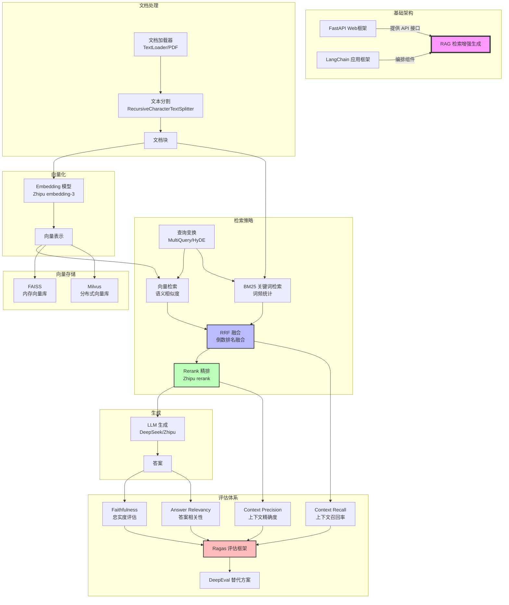

# 概念地图

> 每次完成一个章节后，在这里连接新概念与已有知识。连线含义由你口述，AI Agent 帮你生成 Mermaid 代码。



---

## 概念关联记录

每完成一个章节后在此处手动记录：

| 章节 | 新概念 | 关联到已有概念 | 关联含义 |
|------|--------|--------------|---------|
| 07 | RRF 融合 | BM25 + 向量检索 | RRF 把两种检索结果按排名取倒数求和，不依赖绝对分数 |
| 07 | Rerank 精排 | RRF 融合 | Rerank 在 RRF 粗筛后用专用模型精排，类比搜索引擎二次排序 |
| 09 | Milvus 向量数据库 | FAISS | Milvus 是 FAISS 的生产级替代：多了增删改查、属性过滤、持久化、分布式 |
| 10 | 文档解析 (Unstructured) | TextLoader + 文本分割 | 解析能按结构分类（标题/正文/表格），避免分块截断和结构信息丢失 |

<!-- 继续往下写... -->

---

## 核心流程一句话总结

```
用户问题 → [查询变换优化] → [多路检索(BM25+向量)] → [RRF融合] → [Rerank精排] → [LLM生成] → [评估验证]
                ↑__________________检索增强__________________↑