# 概念地图

> 每次完成一个章节后，在这里连接新概念与已有知识。连线含义由你口述，AI Agent 帮你生成 Mermaid 代码。

```mermaid
graph TD
    %% ====== 基础层 ======
    subgraph 基础架构
        FastAPI[FastAPI Web框架] -->|提供 API 接口| RAG[RAG 检索增强生成]
        LangChain[LangChain 应用框架] -->|编排组件| RAG
    end

    %% ====== 文档处理层 ======
    subgraph 文档处理
        DocLoader[文档加载器<br/>TextLoader/PDF] --> TextSplitter[文本分割<br/>RecursiveCharacterTextSplitter]
        TextSplitter --> Chunks[文档块]
    end

    %% ====== Embedding 层 ======
    subgraph 向量化
        Chunks --> EmbeddingModel[Embedding 模型<br/>Zhipu embedding-3]
        EmbeddingModel --> Vectors[向量表示]
    end

    %% ====== 检索层 ======
    subgraph 检索策略
        Vectors --> VectorSearch[向量检索<br/>语义相似度]
        Chunks --> BM25[BM25 关键词检索<br/>词频统计]
        VectorSearch --> RRF[RRF 融合<br/>倒数排名融合]
        BM25 --> RRF
        RRF --> Rerank[Rerank 精排<br/>Zhipu rerank]
        QueryTransform[查询变换<br/>MultiQuery/HyDE] --> VectorSearch
        QueryTransform --> BM25
    end

    %% ====== 向量数据库层 ======
    subgraph 向量存储
        Vectors --> FAISS[FAISS<br/>内存向量库]
        Vectors --> Milvus[Milvus<br/>分布式向量库]
    end

    %% ====== 生成层 ======
    subgraph 生成
        Rerank --> LLM[LLM 生成<br/>DeepSeek/Zhipu]
        LLM --> Answer[答案]
    end

    %% ====== 评估层 ======
    subgraph 评估体系
        Answer --> Faithfulness[Faithfulness<br/>忠实度评估]
        Rerank --> ContextPrecision[Context Precision<br/>上下文精确度]
        RRF --> ContextRecall[Context Recall<br/>上下文召回率]
        Answer --> AnswerRelevancy[Answer Relevancy<br/>答案相关性]
        Faithfulness --> Ragas[Ragas 评估框架]
        ContextPrecision --> Ragas
        ContextRecall --> Ragas
        AnswerRelevancy --> Ragas
        Ragas --> DeepEval[DeepEval 替代方案]
    end

    %% ====== Agent 层 ======
    subgraph Agent
        ReAct[ReAct 框架<br/>推理+行动循环]
        Tools[自定义工具<br/>Calculator/String/API]
        InfoAbstraction[信息抽象<br/>截断/摘要/引导]
        StatusFeedback[状态反馈<br/>进度/部分失败]
        ErrorRecovery[错误恢复接口<br/>原因+方案+示例]
        AgentMemory[Agent Memory<br/>对话历史/上下文管理]
        ErrorClass[错误三分类<br/>RETRYABLE/PARAMETER_ERROR/PERMANENT]
        StructFeedback[结构化错误反馈<br/>分类+摘要+修复建议]
        Reflection[Reflection 反射循环<br/>失败→反馈→修正→重试]
        Degradation[降级策略<br/>连续失败→转交人类]
        ReAct --> Tools
        Tools --> LLM
        Tools -->|质量属性| InfoAbstraction
        Tools -->|质量属性| StatusFeedback
        Tools -->|质量属性| ErrorRecovery
        Tools -->|失败时触发| ErrorClass
        ErrorClass -->|生成| StructFeedback
        StructFeedback -->|压缩上下文| InfoAbstraction
        StructFeedback -->|驱动| Reflection
        Reflection -->|增强 Observation| ReAct
        ErrorClass -->|系统化升级| ErrorRecovery
        Degradation -->|安全阀| Reflection
        Degradation -->|进阶: Reflexion| AgentMemory
        SQLAgent[SQL Agent<br/>db_schema + db_query]
        SchemaExplore[Schema 探索<br/>先查目录再翻书]
        SQLSafety[SQL 安全校验<br/>只读围栏]
        Tools -->|数据库工具| SQLAgent
        SQLAgent -->|依赖| InfoAbstraction
        SQLAgent -->|依赖| ErrorRecovery
        SQLAgent -->|包含| SchemaExplore
        SQLAgent -->|包含| SQLSafety
        AgentMemory --> ReAct
        FC[Function Calling<br/>JSON Schema + bind_tools]
        ReAct -->|工程化升级| FC
        FC -->|工具定义| Tools
        ResearchAssistant[研究助手 Agent<br/>FC 循环 + 工具工程 + 双层记忆 + 错误反射]
        FC -->|决策引擎| ResearchAssistant
        Tools -->|工具质量| ResearchAssistant
        AgentMemory -->|上下文注入| ResearchAssistant
        Reflection -->|错误修正闭环| ResearchAssistant
        Degradation -->|安全阀| ResearchAssistant
    end

    %% ====== 多 Agent 协作层 ======
    subgraph 多Agent协作
        SwarmAgent[Swarm Agent<br/>角色 + tools]
        Handoff[Handoff 转交<br/>tool 返回 Agent]
        Routine[Routine 预设流程<br/>减少 LLM 调用]
        GroupChat[AutoGen GroupChat<br/>共享上下文]
        RoundRobin[RoundRobinSelector<br/>固定轮询]
        LLMSelector[LLMSelector<br/>动态选人]
        Termination[TerminationCondition<br/>可组合终止]
        StateGraph[StateGraph<br/>声明式状态机]
        GraphNode[Node<br/>处理函数]
        GraphState[State<br/>共享字典]
        ConditionalEdge[ConditionalEdge<br/>条件路由]
        Checkpoint[Checkpoint<br/>断点续跑]
        InvokeStream[invoke / stream<br/>运行与观测]
        SwarmAgent -->|返回目标 Agent| Handoff
        Handoff -->|顺序编排| Routine
        SwarmAgent -->|多人协作扩展| GroupChat
        GroupChat -->|固定顺序| RoundRobin
        GroupChat -->|动态调度| LLMSelector
        GroupChat -->|安全阀| Termination
        FC -->|Selector 也是 FC 决策| LLMSelector
        AgentMemory -->|共享 history| GroupChat
        ReAct -->|形式化为| StateGraph
        StateGraph -->|包含| GraphNode
        StateGraph -->|包含| ConditionalEdge
        GraphNode -->|读取/更新| GraphState
        ConditionalEdge -->|路由| GraphNode
        StateGraph -->|持久化| Checkpoint
        StateGraph -->|暴露| InvokeStream
        StateGraph -->|可表达| Handoff
        StateGraph -->|可表达| GroupChat
    end

    subgraph 性能优化
        cProfile[cProfile<br/>函数级性能采样]
        pstats[pstats<br/>统计数据解析]
        Cumtime[cumtime 累计耗时<br/>含子调用,找时间黑洞]
        Tottime[tottime 自身耗时<br/>不含子调用,找代码热点]
        Callers[print_callers<br/>调用链追踪]
        cProfile --> pstats
        pstats --> Cumtime
        pstats --> Tottime
        pstats --> Callers
        cProfile -->|测量| ResearchAssistant
    end

    %% ====== 缓存层 ======
    subgraph 缓存优化
        ExactCache[精确缓存<br/>SHA256 hash key]
        SemanticCache[语义缓存<br/>Embedding 相似度]
        TTL[TTL 过期时间<br/>平衡命中率与新鲜度]
        CacheAside[Cache-Aside 模式<br/>查缓存→调LLM→写缓存]
        ExactCache -->|完全相同才命中| CacheAside
        SemanticCache -->|意思相近即可命中| CacheAside
        TTL -->|设置过期时间| ExactCache
        TTL -->|设置过期时间| SemanticCache
        CacheAside -->|包裹| LLM
        %% 异步连接
        cProfile -->|I/O 瓶颈驱动| AsyncIO
        ExactCache -->|消除重复 I/O| AsyncIO
        SemanticCache -->|消除重复 I/O| AsyncIO
        FC -->|ainvoke 替代 invoke| Ainvoke
    end

    %% ====== 异步处理层 ======
    subgraph 异步处理
        AsyncIO[asyncio 事件循环<br/>单线程协作式调度]
        Ainvoke[llm.ainvoke<br/>异步 LLM 调用]
        AsyncSearch[asimilarity_search<br/>异步向量检索]
        Gather[asyncio.gather<br/>并发执行协程]
        AsyncIO -->|调度| Ainvoke
        AsyncIO -->|调度| AsyncSearch
        AsyncIO -->|批量并发| Gather
    end

    %% ====== 批处理优化层 ======
    subgraph 批处理优化
        BatchEmbed[Embedding 批处理<br/>embed_documents 合并请求]
        LLMBatch[LLM 并发批处理<br/>llm.batch 线程池并发]
        BatchSize[Batch Size 权衡<br/>吞吐 vs 延迟 vs API 上限]
        BatchEmbed -->|减少网络往返| BatchSize
        LLMBatch -->|控制并发度| BatchSize
    end

    %% ====== 批处理连接 ======
    EmbeddingModel -->|一次 API 处理 N 条文本| BatchEmbed
    LLM -->|线程池并发 invoke| LLMBatch
    AsyncIO -->|互补：合并+重叠| BatchEmbed
    AsyncIO -->|互补：合并+重叠| LLMBatch
    ExactCache -->|缓存预热依赖| BatchEmbed
    SemanticCache -->|缓存预热依赖| BatchEmbed

    %% ====== 样式 ======
    style RAG fill:#f9f,stroke:#333,stroke-width:4px
    style RRF fill:#bbf,stroke:#333,stroke-width:2px
    style Rerank fill:#bfb,stroke:#333,stroke-width:2px
    style Ragas fill:#fbb,stroke:#333,stroke-width:2px
    style ReAct fill:#fcf,stroke:#333,stroke-width:3px
    style Tools fill:#ff9,stroke:#333,stroke-width:3px
    style FC fill:#ddf,stroke:#333,stroke-width:3px
    style ResearchAssistant fill:#ff9,stroke:#f00,stroke-width:4px
    style cProfile fill:#ddf,stroke:#333,stroke-width:3px
    style Cumtime fill:#bbf,stroke:#333,stroke-width:2px
    style Tottime fill:#bfb,stroke:#333,stroke-width:2px
    style ExactCache fill:#bbf,stroke:#333,stroke-width:2px
    style SemanticCache fill:#bfb,stroke:#333,stroke-width:2px
    style AsyncIO fill:#ff9,stroke:#333,stroke-width:3px
    style Ainvoke fill:#bbf,stroke:#333,stroke-width:2px
    style Gather fill:#bfb,stroke:#333,stroke-width:2px
    style BatchEmbed fill:#ff9,stroke:#333,stroke-width:3px
    style LLMBatch fill:#bbf,stroke:#333,stroke-width:2px
    style BatchSize fill:#fbb,stroke:#333,stroke-width:2px
    style SwarmAgent fill:#fcf,stroke:#333,stroke-width:2px
    style GroupChat fill:#ff9,stroke:#333,stroke-width:3px
    style RoundRobin fill:#bbf,stroke:#333,stroke-width:2px
    style LLMSelector fill:#bfb,stroke:#333,stroke-width:2px
    style Termination fill:#fbb,stroke:#333,stroke-width:2px
    style StateGraph fill:#ff9,stroke:#f00,stroke-width:4px
    style GraphNode fill:#bbf,stroke:#333,stroke-width:2px
    style GraphState fill:#bfb,stroke:#333,stroke-width:2px
    style ConditionalEdge fill:#fbb,stroke:#333,stroke-width:2px
    style Checkpoint fill:#fcf,stroke:#333,stroke-width:2px
    style InvokeStream fill:#ddf,stroke:#333,stroke-width:2px
```



---

## 概念关联记录

每完成一个章节后在此处手动记录：

| 章节 | 新概念 | 关联到已有概念 | 关联含义 |
|------|--------|--------------|---------|
| 07 | RRF 融合 | BM25 + 向量检索 | RRF 把两种检索结果按排名取倒数求和，不依赖绝对分数 |
| 07 | Rerank 精排 | RRF 融合 | Rerank 在 RRF 粗筛后用专用模型精排，类比搜索引擎二次排序 |
| 09 | Milvus 向量数据库 | FAISS | Milvus 是 FAISS 的生产级替代：多了增删改查、属性过滤、持久化、分布式 |
| 10 | 文档解析 (Unstructured) | TextLoader + 文本分割 | 解析能按结构分类（标题/正文/表格），避免分块截断和结构信息丢失 |
| 11 | AdvancedRAG 集成管线 | Query Transform + 混合检索 + Rerank | 管线串联：Multi-Query 改写决定天花板，混合检索互补盲区，Rerank 精排降噪，Faithfulness 防幻觉 |
| 12 | Agent / ReAct | LLM + Tools | RAG 是单向检索→生成，Agent 是循环思考→行动→观察→再思考，能调用外部工具完成任务 |
| 13 | 信息抽象 | Tools → LLM | 工具返回截断+摘要+引导，防止上下文过载；LLM 按引导逐层深入，用多轮循环弥补窗口限制 |
| 13 | 状态反馈 | Tools → ReAct | 工具报告进度+成功/失败详情+后续建议；Agent 据此在下一轮针对性地处理失败项 |
| 13 | 错误恢复接口 | Tools → LLM | 错误信息包含"原因+可用选项+正确示例"，让 LLM 自主修正而非盲猜 |
| 14 | Schema 探索 | Tools + 信息抽象 | Agent 先查目录再翻书——了解表结构后识别相关字段生成精确 SQL，避免 SELECT * 上下文爆炸 |
| 14 | SQL 安全校验 | Tools + 错误恢复 | \b 独立单词匹配拦截写操作，防止 Agent 幻觉导致数据篡改/删除等不可逆灾难 |
| 15 | Function Calling JSON Schema | ReAct + Tools | FC 把 ReAct 的工具定义从文本描述升级为 JSON Schema，解析可靠性从 ~80% 提升到 ~99%，还支持并行调用 |
| 16 | 短期记忆 (ShortTermMemory) | ReAct + AgentMemory | 内存全文缓冲区保存当前会话的完整交互历史，超出窗口则截断最早的消息 |
| 16 | 长期记忆 (LongTermMemory) | AgentMemory + FAISS | 向量存储保存用户偏好和关键决策，跨会话持久化，语义检索而非全文匹配 |
| 17 | 错误三分类 | 13章 错误恢复接口 | 把工具返回的错误信息升级为系统化三分类，让 LLM 的行为从"再试一次"变成"检查参数再试"或"立即放弃" |
| 17 | Reflection 反射循环 | 12章 ReAct | 反射是 ReAct Observation 环节的增强——失败时不只是返回错误，还附加分类+修复建议，让 LLM 自主修正 |
| 17 | 结构化错误反馈 (Compact Errors) | 13章 信息抽象 | 和工具输出截断同理：错误信息只给分类+摘要+修复建议，不堆栈追踪，按 12-Factor Agent 原则 9 压缩到上下文窗口 |
| 17 | 降级策略 | 16章 AgentMemory + Reflection | 连续失败触发降级防止死循环；Reflexion 是进阶版——把失败经验写入长期记忆跨会话避免重复犯错 |
| 18 | ResearchAssistant 集成 | FC + Tools + AgentMemory + Reflection + Degradation | 四大模块形成完整能力闭环：FC循环=决策框架，工具工程=可靠性，记忆=体验，反射=安全网 |
| 18 | Agent 模块职责边界 | 13章工具工程 + 16章记忆 + 17章错误处理 | 各模块有清晰的职责边界：工具保证单次调用成功率，记忆消除重复声明摩擦，反射阻断错误累积衰减 |
| 18 | 错误分类权威来源 | 17章错误三分类 + 13章错误恢复接口 | 工具的 category 是唯一权威来源；classify_error 只用于意外异常的分类兜底，避免两个分类系统冲突 |
| 19 | cProfile + pstats | ResearchAssistant + LLM + httpx | cProfile 对 Agent.run() 做函数级采样；cumtime 定位网络 I/O 时间黑洞（LLM API 调用占 90%+），tottime 定位 CPU 热点；print_callers 追踪慢函数调用链 |
| 20 | 精确缓存 (ExactMatchCache) | 19章性能瓶颈 + LLM + fakeredis | SHA256(prompt) 做 key，字符级完全相同才命中；第二轮 benchmark 0.0s 证明缓存消除了 LLM API 瓶颈 |
| 20 | 语义缓存 (SemanticCache) | 精确缓存 + Embedding + FAISS | 用 embedding 余弦相似度匹配"意思相近"的查询；threshold 控制命中范围和准确度，解决同义改写穿透精确缓存的问题 |
| 21 | asyncio 事件循环 | cProfile + ExactCache + FC | cProfile 发现的 I/O 瓶颈驱动 async 改造；缓存消除重复 I/O，async 让非重复 I/O 等待时间重叠；`llm.ainvoke()` 是 FC 循环的异步升级 |
| 22 | Embedding 批处理 + LLM 并发批处理 | ch04 EmbeddingModel + ch21 AsyncIO + ch20 缓存预热 | `embed_documents(texts)` 本身就是批处理，从 ch04 就在用，本章量化了收益（30 条 11x 加速）；`llm.batch()` 是框架级并发（线程池），非 API 级合并；批处理和异步互补——合并请求+重叠等待；缓存预热依赖批处理做批量向量化和并发生成 |
| 23 | PagedAttention | 19章性能瓶颈 + GPU 显存 + 虚拟内存 | PagedAttention 把 OS 分页管理搬进 KV Cache：按需分配 block（每 block 16 token），显存利用率 20%→90%+；同前缀的 KV Cache block 可共享（Copy-on-Write） |
| 23 | Continuous Batching | 22章 llm.batch + AsyncIO | 以 token 为粒度调度而非请求粒度：每步生成后可重组 batch，GPU 利用率 30%→85%+；和 PagedAttention 正交互补——前者让内存灵活分配以容纳更多请求，后者让 GPU 一直有活干 |
| 23 | vLLM 自部署 vs API 服务 | ch01 FastAPI + ch04 EmbeddingModel | 自部署：成本可控、延迟低、可控性强，但需要运维 GPU 集群；API 服务：零运维、弹性伸缩，但成本随量增长、受限于 rate limit |
| 24 | locust 压测 | 19章 Profiling + 20章 缓存 + 21章 异步 | locust 模拟 N 个并发用户压测 API；关键指标 QPS/P50/P99/错误率；优化报告结构：基准数据→优化措施→效果量化→成本分析 |
| S5 | Docker 容器化 | ch01 FastAPI + 18章 ResearchAssistant | LLM 应用 Docker 化的特殊挑战：镜像体积（PyTorch 百MB级）、启动时间（模型加载分钟级）、健康检查需探测模型状态、有状态（KV Cache/对话历史） |
| S5 | Prometheus + Grafana 监控 | 20章缓存命中率 + 21章异步 + 22章批处理 | LLM 应用需暴露的自定义指标：Token 消耗（按模型/类型分）、缓存命中率、GPU 利用率、降级次数；成本监控是最大差异——常规服务按 CPU/内存，LLM 按 Token 数计费 |
| 26 | Swarm Handoff 机制 | 12章 ReAct + 15章 Tool Calling | Handoff 是普通的 tool function，返回值是目标 Agent；框架检测到 Agent 对象时自动切换，不是特殊机制；Routine 模式预设流程减少 LLM 调用 |
| 26 | Agent 职责单一原则 | 13章 工具工程 + 17章 错误处理 | 每个 Agent 只聚焦一个角色（业务 vs 技术），system prompt 更短更精确；终端 Agent 无 handoff 防止无限转交；和微服务拆分同构 |
| 27 | AutoGen GroupChat | 26章 Swarm + 15章 FC | GroupChat 是 Swarm 的多人扩展；RoundRobin 固定轮询 vs Selector LLM 动态选人；TerminationCondition 可组合；AgentTool 把 Agent 包装成 Tool 实现递归组合 |
| 28 | CrewAI 三段式定义 | 16章 Memory + 13章 工具工程 | Agent(role+goal+backstory) → Task(desc+expected_output) → Crew(agents+tasks+process)；YAML 声明式适合生产；Sequential/Hierarchical 两种 Process |
| 28 | 多 Agent 框架选型 | 26章 Swarm + 27章 AutoGen | Swarm=两人转交，AutoGen=多人讨论，CrewAI=任务流水线；EDMS 等系统需要按子问题混合使用 |
| 29 | LangGraph StateGraph | 12章 Agent 循环 + 26章 Swarm | 把 while 循环变成声明式状态机：Node=处理函数，ConditionalEdge=路由决策，Checkpoint=断点续跑；原生支持 HITL/streaming/并行，生产环境首选 |
| 29 | ConditionalEdge | 12章 ReAct + 15章 FC | 把 ReAct 里隐式的「是否继续循环」判断，显式化为图中的条件边，路由决策可观测、可调试 |
| 29 | Checkpoint | 16章 AgentMemory + 17章 Reflection | 每步状态持久化，支持崩溃后从断点续跑，是 Reflection 跨轮修正的数据基础 |
| 29 | invoke / stream | 21章 AsyncIO + 18章 ResearchAssistant | invoke 一次性运行适合批处理，stream 流式暴露中间状态适合 UI 实时反馈和人工介入 |

---

## 核心流程一句话总结

```
RAG 管线:
用户问题 → [查询变换优化] → [多路检索(BM25+向量)] → [RRF融合] → [Rerank精排] → [LLM生成] → [评估验证]
                ↑__________________检索增强__________________↑

Agent 工具调用闭环:
用户任务 → [ReAct 思考] → [工具调用] → [成功→Observation | 失败→错误分类→结构化反馈→Reflection 修正→重试]
                              ↑__连续失败→降级(转交人类)__↑

ResearchAssistant 集成闭环:
用户输入 → [长期记忆检索(偏好)] → [短期记忆注入(历史)] → [FC 循环(bind_tools)] 
    → [工具执行(信息抽象+状态反馈)] → [失败→工具分类(权威)→反馈→重试/降级]
    → 最终答案 → [更新短期记忆]

异步并发加速:
同步: query1 → 等API → query2 → 等API → ... (串行, Σ耗时)
异步: query1..N → [同时发请求] → [I/O等待重叠] → [同时收结果] (并发, ≈max耗时)
    llm.invoke() → await llm.ainvoke()
    vectorstore.similarity_search() → await vectorstore.asimilarity_search()
    for q in queries → await asyncio.gather(*tasks)

批处理加速:
逐条: 每条一次 API 请求 → N 次 RTT → Σ耗时 ≈ N×(RTT+计算)
批量: N 条合并为一次请求 → 1 次 RTT → 耗时 ≈ RTT + N×计算
    逐条: for t in texts: embeddings.embed_documents([t])  → N 次 API
    批量: embeddings.embed_documents(texts)              → 1 次 API
    vLLM 服务增强:
用户请求 → [OpenAI 兼容 API] → [PagedAttention 分页管理 KV Cache] → [Continuous Batching 动态调度 Batch] → GPU 推理 → 响应
            ↑__自部署: 成本可控、低延迟、需运维 GPU__↑  vs  ↑__API 服务: 零运维、弹性伸缩、受限于 rate limit__↑

监控与部署流水线:
代码 → [Docker 多阶段构建] → [容器化部署 K8s/Docker Compose] → [Prometheus 采集 /metrics] → [Grafana 可视化 Dashboard]
                                                                    ├── llm_requests_total (QPS)
                                                                    ├── llm_latency_seconds (P50/P95/P99)
                                                                    ├── llm_tokens_total (成本)
                                                                    └── cache_hit_rate (优化效果)

多 Agent 协作流程:
用户任务 → [Crew/GroupChat 编排]
              ├→ Agent A (研究员): 搜索资料 [Tool: web_search]
              ├→ Agent B (分析师): 提炼观点 [Tool: summarize]
              ├→ Agent C (写手):   撰写报告 [Tool: none]
              └→ Agent D (审核):   事实校验 [Tool: verify]
          → 最终输出（经过多角色 review）
               ↑__顺序接力 sequential__↑  vs  ↑__自由讨论 groupchat__↑  vs  ↑__层级委托 hierarchical__↑

LangGraph 状态机工作流:
用户任务 → [START] → [Node: 处理函数] → [ConditionalEdge: 条件路由]
              ↓ 不满足条件              ↓ 满足条件
         [Node: 继续处理] ←──────── [Node: 下一步]
              ↓
         [Checkpoint: 保存状态] → [人工审核 / 崩溃恢复]
              ↓
         [END] → 最终输出
         ↑__invoke: 一次性运行__↑  vs  ↑__stream: 流式观测每一步__↑
```