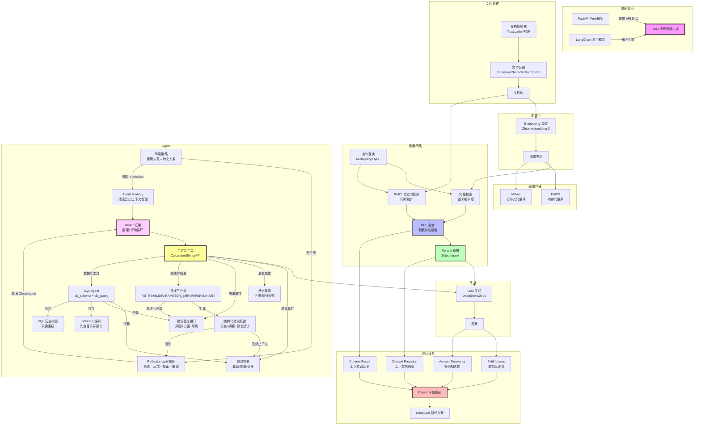

# 概念地图

> 每次完成一个章节后，在这里连接新概念与已有知识。连线含义由你口述，AI Agent 帮你生成 Mermaid 代码。



---

## 概念关联记录

每完成一个章节后在此处手动记录：

| 章节 | 新概念 | 关联到已有概念 | 关联含义 |
|------|--------|--------------|---------|
| 07 | RRF 融合 | BM25 + 向量检索 | RRF 把两种检索结果按排名取倒数求和，不依赖绝对分数 |
| 07 | Rerank 精排 | RRF 融合 | Rerank 在 RRF 粗筛后用专用模型精排，类比搜索引擎二次排序 |
| 09 | Milvus 向量数据库 | FAISS | Milvus 是 FAISS 的生产级替代：多了增删改查、属性过滤、持久化、分布式 |
| 10 | 文档解析 (Unstructured) | TextLoader + 文本分割 | 解析能按结构分类（标题/正文/表格），避免分块截断和结构信息丢失 |
| 11 | AdvancedRAG 集成管线 | Query Transform + 混合检索 + Rerank | 管线串联：Multi-Query 改写决定天花板，混合检索互补盲区，Rerank 精排降噪，Faithfulness 防幻觉 |
| 12 | Agent / ReAct | LLM + Tools | RAG 是单向检索→生成，Agent 是循环思考→行动→观察→再思考，能调用外部工具完成任务 |
| 13 | 信息抽象 | Tools → LLM | 工具返回截断+摘要+引导，防止上下文过载；LLM 按引导逐层深入，用多轮循环弥补窗口限制 |
| 13 | 状态反馈 | Tools → ReAct | 工具报告进度+成功/失败详情+后续建议；Agent 据此在下一轮针对性地处理失败项 |
| 13 | 错误恢复接口 | Tools → LLM | 错误信息包含"原因+可用选项+正确示例"，让 LLM 自主修正而非盲猜 |
| 14 | Schema 探索 | Tools + 信息抽象 | Agent 先查目录再翻书——了解表结构后识别相关字段生成精确 SQL，避免 SELECT * 上下文爆炸 |
| 14 | SQL 安全校验 | Tools + 错误恢复 | \b 独立单词匹配拦截写操作，防止 Agent 幻觉导致数据篡改/删除等不可逆灾难 |
| 15 | Function Calling JSON Schema | ReAct + Tools | FC 把 ReAct 的工具定义从文本描述升级为 JSON Schema，解析可靠性从 ~80% 提升到 ~99%，还支持并行调用 |
| 16 | 短期记忆 (ShortTermMemory) | ReAct + AgentMemory | 内存全文缓冲区保存当前会话的完整交互历史，超出窗口则截断最早的消息 |
| 16 | 长期记忆 (LongTermMemory) | AgentMemory + FAISS | 向量存储保存用户偏好和关键决策，跨会话持久化，语义检索而非全文匹配 |
| 17 | 错误三分类 | 13章 错误恢复接口 | 把工具返回的错误信息升级为系统化三分类，让 LLM 的行为从"再试一次"变成"检查参数再试"或"立即放弃" |
| 17 | Reflection 反射循环 | 12章 ReAct | 反射是 ReAct Observation 环节的增强——失败时不只是返回错误，还附加分类+修复建议，让 LLM 自主修正 |
| 17 | 结构化错误反馈 (Compact Errors) | 13章 信息抽象 | 和工具输出截断同理：错误信息只给分类+摘要+修复建议，不堆栈追踪，按 12-Factor Agent 原则 9 压缩到上下文窗口 |
| 17 | 降级策略 | 16章 AgentMemory + Reflection | 连续失败触发降级防止死循环；Reflexion 是进阶版——把失败经验写入长期记忆跨会话避免重复犯错 |

<!-- 继续往下写... -->

---

## 核心流程一句话总结

```
RAG 管线:
用户问题 → [查询变换优化] → [多路检索(BM25+向量)] → [RRF融合] → [Rerank精排] → [LLM生成] → [评估验证]
                ↑__________________检索增强__________________↑

Agent 工具调用闭环:
用户任务 → [ReAct 思考] → [工具调用] → [成功→Observation | 失败→错误分类→结构化反馈→Reflection 修正→重试]
                              ↑__连续失败→降级(转交人类)__↑
```