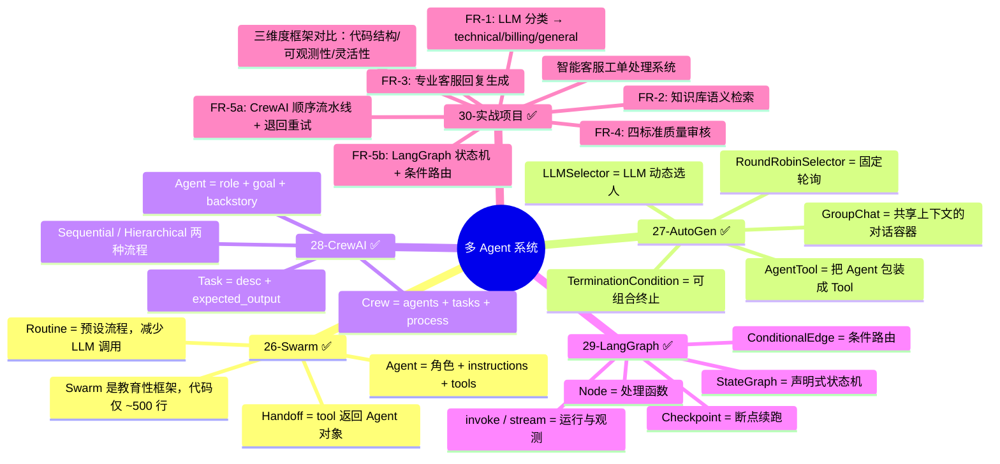

# Stage 6 — 多 Agent 系统

```mermaid
mindmap
  root((多 Agent 系统))
    26-Swarm ✅
      Agent = 角色 + instructions + tools
      Handoff = tool 返回 Agent 对象
      Routine = 预设流程，减少 LLM 调用
      Swarm 是教育性框架，代码仅 ~500 行
    27-AutoGen ✅
      GroupChat = 共享上下文的对话容器
      RoundRobinSelector = 固定轮询
      LLMSelector = LLM 动态选人
      TerminationCondition = 可组合终止
      AgentTool = 把 Agent 包装成 Tool
    28-CrewAI ✅
      Agent = role + goal + backstory
      Task = desc + expected_output
      Crew = agents + tasks + process
      Sequential / Hierarchical 两种流程
    29-LangGraph ✅
      StateGraph = 声明式状态机
      Node = 处理函数
      ConditionalEdge = 条件路由
      Checkpoint = 断点续跑
      invoke / stream = 运行与观测
    30-实战项目 ✅
      智能客服工单处理系统
      FR-1: LLM 分类 → technical/billing/general
      FR-2: 知识库语义检索
      FR-3: 专业客服回复生成
      FR-4: 四标准质量审核
      FR-5a: CrewAI 顺序流水线 + 退回重试
      FR-5b: LangGraph 状态机 + 条件路由
      三维度框架对比：代码结构/可观测性/灵活性
```
